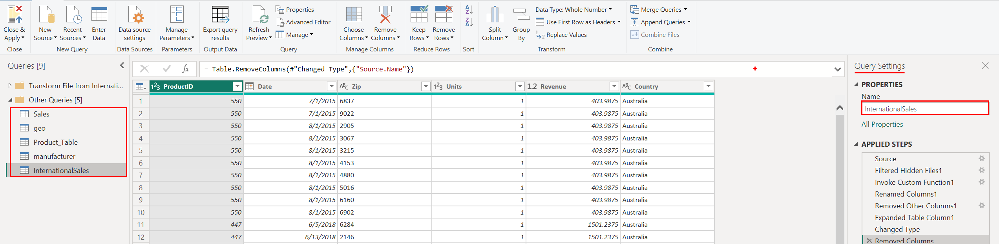
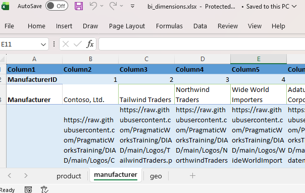

# Dashboard in a Day, except with pySpark instead of Power Query

So you've completed the Power BI Dashboard-in-a-Day workshop! I hope you loved it as much as I have. 

* When you completed the Power Query exercise, it probably took 5 minutes (or longer) to do all of the transformations on your laptop, and you wondered, "Couldn't I just do this in the cloud instead?" 
    * Well of course you can, using Dataflows Gen2 (Power Query Online), but this is an excellent opportunity to get started with pySpark notebooks!
* Internally at Microsoft, notebooks are popular because they're cheaper and faster (although that difference has shrunk a lot recently), and it's easier than ever to learn now that Copilot is integrated into the experience. 
* So let's jump in and use Notebooks to build the Dashboard-in-a-Day dataset, and be amazed at the speed and convenience of transforming and loading your Power BI data.

## One tiny cheat - the Excel file (bi_dimensions.xlsx)
* All the data for DIAD is available as a download from Microsoft's DAID workshop site,
    * https://learn.microsoft.com/en-us/training/modules/intro-power-bi/
* However, three of the dimension tables are in the Microsoft Excel file **bi_dimensions.xlsx.**

* Yes, there are Pandas libraries for exracting data from Excel, but for the sake of keeping the notebooks easy to follow, I have simply done a 'Save As CSV' from the source Excel file and presented the files as .csv in the attached .zip [bi_dimensions_csv.zip](bi_dimensions_csv.zip)

    * I preserved the orignal excercise challenges of the .xlsx file, like removing the header and footer rows, etc.

## Another tiny cheat - the DAX calculated columns and tables
* The original Dashboard-in-a-Day teaches DAX by creating Calculated Columns and a Calculated Table, neither of which are supported in Direct Lake mode (as of this writing)
* Arguably, it would be a data engineering best-practice to move these calculations upstream to the data loading phase anyway
* Therefore I've added the DIAD calculated columns exercise into the notebooks themselves
* I have also added a simple Date.csv table for convenience, replacing the DAX table creation step.

## AI Disclaimer
* Copilot did help with some of the trickier transformations, such as "transpose." These are aidentified in the Notebook comments where they occurred. 